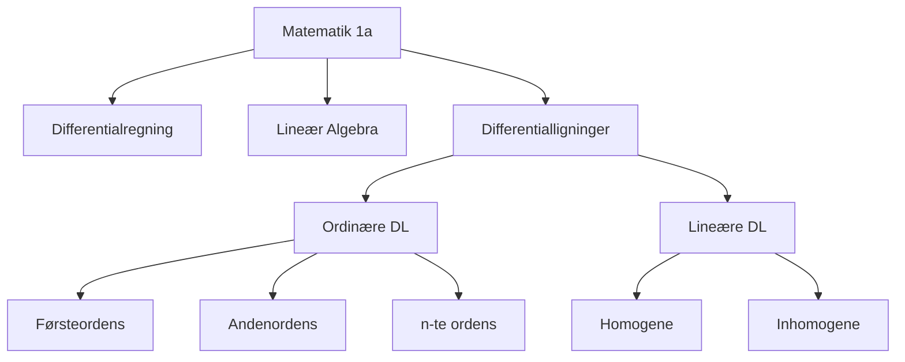

# 01001 - Matematik 1a (Polyteknisk grundlag)

## Course Information
- **Course Code**: 01001
- **Course Name**: Matematik 1a (Polyteknisk grundlag)
- **Semester**: 2025 Fall
- **University**: Technical University of Denmark (DTU)
- **Credits**: 10 ECTS

## Recent Lectures
- [[2025-11-25-01001-lecture.pdf|Lecture Nov 25, 2025 - Differentialligninger]]
- [[2025-12-02-01001-lecture.pdf|Lecture Dec 02, 2025]]

## Key Topics

### Differential Equations
- [[Ordinære Differentialligninger (ODE)]]
- [[Lineære ODE'er]]
- [[Homogene og Inhomogene ODE'er]]
- [[Komplekse Funktioner med Reelt Input]]

### Linear Algebra
- [[Lineære Afbildninger]]
- [[Vektorrum]]
- [[Løsningsmængder]]

### Calculus
- [[Differentialregning]]
- [[Afledede af Højere Orden]]
- [[Grænseværdier]]

## Course Structure

## Important Notation
- $f'(t)$ eller $f^((1))(t)$ - Første afledte
- $f''(t)$ eller $f^((2))(t)$ - Anden afledte
- $f^((n))(t)$ - n-te afledte
- $f^((0))(t) = f(t)$

## Connections to Other Courses
- [[01002-Matematik 1b|01002 - Matematik 1b]] - Fortsættelse af calculus
- [[10060-Fysik|10060 - Fysik]] - Anvendelse af differentialligninger

## Prerequisites
- High school mathematics
- Basic calculus

## Leads To
- [[01002-Matematik 1b]] - Functions of several variables
- Advanced calculus courses

## Resources
- Textbook: Linear Algebra and Differential Equations
- dtumathtools Python package

