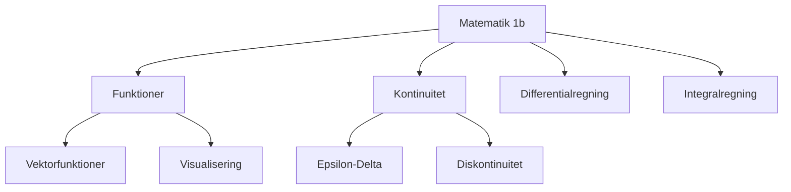

# 01002 - Matematik 1b (Polyteknisk grundlag)

## Course Information
- **Course Code**: 01002
- **Course Name**: Matematik 1b (Polyteknisk grundlag)
- **Semester**: 2026 Spring
- **University**: Technical University of Denmark (DTU)
- **Credits**: 5 ECTS

## Recent Lectures
- [[2026-02-03-01002-lecture.pdf|Lecture Feb 03, 2026 - Funktioner 1]]

## Key Topics

### Functions and Vector Functions
- [[Vektorfunktioner]]
- [[Koordinatfunktioner]]
- [[Injektivitet og Surjektivitet]]
- [[Domæne og Billedrum]]

### Continuity
- [[Kontinuitet]]
- [[Epsilon-Delta Definition]]
- [[Diskontinuitet]]

### Neural Networks (Applied)
- [[Neurale Netværk]]
- [[ReLU Aktiveringsfunktion]]

### Visualization
- [[Niveaukurver]]
- [[Grafer af Funktioner]]

## Course Structure

## Connections to Other Courses
- [[01001|Matematik 1a]] - Prerequisites
- [[02161|Software Engineering 1]] - Applications of functions

## Resources
- Textbook: https://01002.compute.dtu.dk/_assets/textbook_mat1b_en.pdf
- Course website: https://01002.compute.dtu.dk/
- dtumathtools Python package

