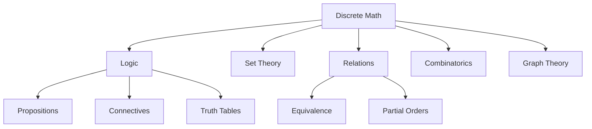

# 01017 - Discrete Mathematics

## Course Information
- **Course Code**: 01017
- **Course Name**: Discrete Mathematics
- **Semester**: 2025 Fall
- **University**: Technical University of Denmark (DTU)
- **Credits**: 5 ECTS

## Recent Lectures
- [[2025-09-04-01017-lecture.pdf|Lecture Sep 04, 2025 - Propositions and Logic]]
- [[2025-11-20-01017-lecture.pdf|Lecture Nov 20, 2025 - Relations]]

## Key Topics

### Logic
- [[Propositioner (Propositions)]]
- [[Logiske Operatorer]]
- [[Negation]]
- [[Konjunktion og Disjunktion]]
- [[Implikation og Biimplikation]]
- [[Kontraposition og Konvers]]

### Set Theory
- [[Mængder (Sets)]]
- [[Power Sets]]
- [[Relationer]]

### Relations
- [[Ækvivalensrelationer]]
- [[Ækvivalensklasser]]
- [[Partially Ordered Sets (Posets)]]

## Course Structure

## Important Definitions

### Logic
- **Proposition**: Declarative sentence that is true or false
- **Negation** ($\neg p$): Opposite of $p$
- **Conjunction** ($p \land q$): "$p$ and $q$"
- **Disjunction** ($p \lor q$): "$p$ or $q$"
- **Implication** ($p \to q$): "if $p$, then $q$"

### Relations
- **Equivalence Relation**: Reflexive, symmetric, transitive
- **Partial Order**: Reflexive, antisymmetric, transitive

## Connections to Other Courses
- [[02161|Software Engineering 1]] - Logic for program verification
- [[01001-Matematik 1a|01001]] - Set theory and functions
- Computer Science courses - Graph theory, algorithms

## Key Concepts to Master
- Truth tables
- Logical equivalence
- Proof techniques (direct, contrapositive, contradiction)
- Equivalence classes
- Congruence modulo n

## Resources
- Textbook: *Discrete Mathematics and Its Applications* (Rosen)
- Practice: Proof writing

