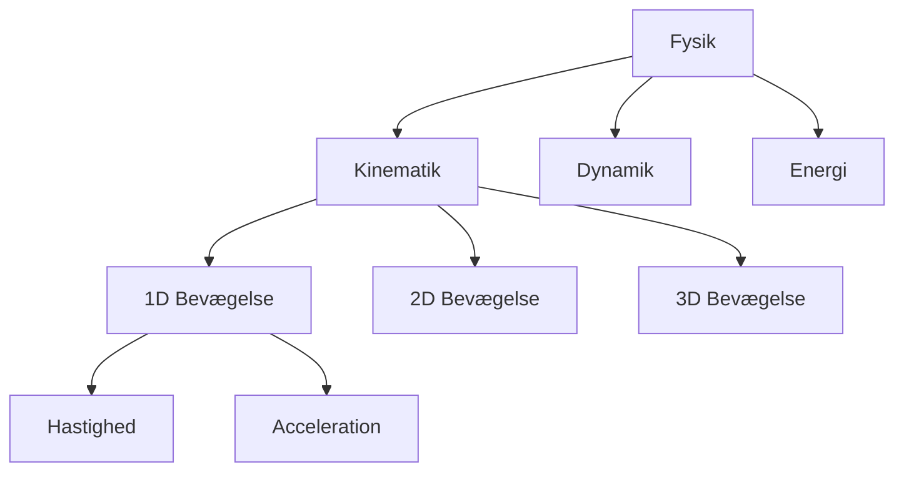

# 10060 - Fysik (Polyteknisk grundlag)

## Course Information
- **Course Code**: 10060
- **Course Name**: Fysik (Polyteknisk grundlag)
- **Semester**: 2026 Spring
- **University**: Technical University of Denmark (DTU)
- **Credits**: 5 ECTS

## Recent Lectures
- [[2026-02-01-10060-lecture.pdf|Lecture Feb 01, 2026]]
- [[2026-02-02-10060-lecture.pdf|Lecture Feb 02, 2026 - Kinematik 1D]]

## Key Topics

### Mechanics
- [[Kinematik 1D]]
- [[Hastighed og Acceleration]]
- [[Konstant Acceleration]]
- [[Bevægelsesligninger]]

### Mathematical Tools
- [[Curl og Gradient]]
- [[Tensorer]]
- [[Partielle Afledede]] (også i [[01002-Matematik 1b]])

## Course Structure

## Connections to Other Courses
- [[01002-Matematik 1b]] - Calculus, partielle afledede
- [[01001|Matematik 1a]] - Differentialregning, vektorer

## Problem-Solving Strategy
1. Vælg koordinatsystem (sæt $t = 0$ når $x_0 = 0$)
2. Vælg positiv retning
3. Omform oplysninger til symboler
4. Identificer kendte og ukendte størrelser
5. Find "skjulte" informationer
6. Opstil relevante ligninger
7. Enhedskontrol og grænsekontrol

## Resources
- Textbook: *University Physics*
- dtumathtools Python package

